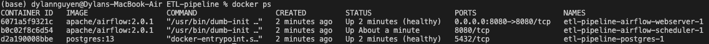
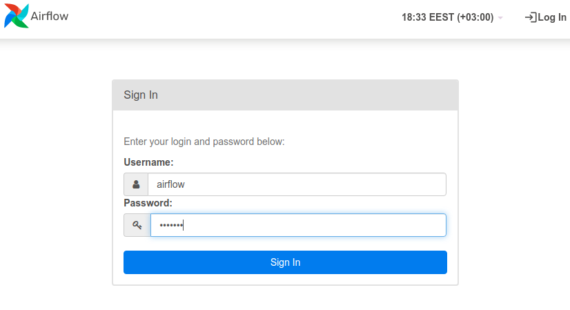
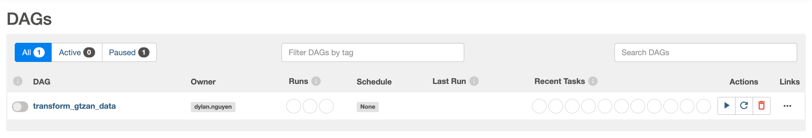
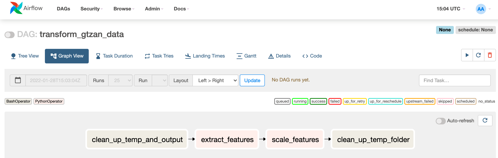
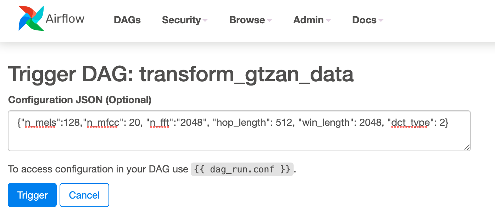

<h1 align="center">ETL Pipeline with Airflow and Python</h1>

<p align="center">
  <a href="#about">About</a> •
  <a href="#prerequisites">Prerequisites</a> •
  <a href="#set-up">Set-up</a> •
  <a href="#installation">Installation</a> •
  <a href="#airflow-interface">Airflow Interface</a> •
  <a href="#pipeline-design">Pipeline Design</a> •
  <a href="#airflow-cli">Airflow CLI</a> •
  <a href="#optional-paramters">Optional Parameters</a> •
  <a href="#shut-down-and-restart-airflow">Shut Down and Restart Airflow</a> •
  <a href="#further-discussion">Further Discussion</a> •
  <a href="#credits">Credits</a>
</p>

---

## About

Utopia Music's Assignment to create a data pipeline for feature extraction and scaling with Python and Airflow.

The project is built in Python and it has 2 main parts:
  1. The Airflow DAG file, [**dags/utopia.py**](/dags/utopia.py), which orchestrates the data pipeline tasks.
  2. The PySpark data transformation/processing script, located in [**dags/utils**](/dags/utils/)


## Prerequisites
- [Docker](https://docs.docker.com/get-docker/)
- [Docker Compose](https://docs.docker.com/compose/)

## Set-up

- Make sure Docker Desktop is running, and at least 4GB of memory is allocated for the Docker Engine (ideally 8Gb). You can check and change the amount of memory in Resource. You can also check if you have enough memory by running this command:

```
docker run --rm "debian:buster-slim" bash -c 'numfmt --to iec $(echo $(($(getconf _PHYS_PAGES) * $(getconf PAGE_SIZE))))'
```

- Download / pull the repo to your desired location.

- Download the GTZAN data set from [here](http://opihi.cs.uvic.ca/sound/genres.tar.gz) and extract into the input folder.


## Installation

Start the installation with:
```
chmod +x ./startup.sh
./startup.sh input_folder_here output_folder_here
```

This command updates the [startup.sh]() script with execute permission and execute the script. [startup.sh]() asks for two parameters, absolute path of the input folder and absolute path of the output folder. The output folder should be empty, and the input folder should be organized like this:

```
/input_folder 
    /genre1
        file1.wav
    /genre2
        file2.wav
```

[startup.sh]() creates two named volumes, called input_folder and output_folder, and bind mount the indicated local directories to these volumes. Afterwards, it will pull and create Docker images and containers for Airflow, according to the instructions in the [docker-compose.yml](/docker-compose.yml) file. After everything has been installed, you can check the status of your containers (if they are healthy) with:

    docker ps

**Note**: it might take up to two to three minutes for the containers to have the **healthy** flag after starting.

<p align="center"></p>

## Airflow Interface

You can now access the Airflow web interface by going to http://localhost:8080/. If you have not changed them in the docker-compose.yml file, the default user is **airflow** and password is **airflow**:

<p align="center"></p>

After signing in, the Airflow home page is the DAGs list page. Here you will see all your DAGs and the Airflow example DAGs, sorted alphabetically. 

Any DAG python script saved in the directory [**dags/**](/dags/), will show up on the DAGs page (e.g. `transform_gtzan_data` is the one built for this project).

<p align="center"></p>

Click on the name of the dag to open the DAG details page:

<p align="center"></p>

## Pipeline Design

<p align="center"></p>

The two main tasks of this DAG are:
- extract features, which extract two features, Mel Spectrogram and MFCCs from each of the audio files, and store them as npy files into a temporary folder,
- and scale features, whichs go through each of the npy files in the temporary folder, and scale it in two ways, using standard scaler and min-max scaler from sklearn library, and store them as npy files into the final library.

The reasoning behind this design is to put an intermediary storage layer between the source and the destination folder. This helps us separate the testing and rerunning of the feature extraction and scaling.

On the other hand, there are tasks at the beginning and the end to clean up temporary folder and output folder content. 

#### Task `clean_up_temp_and_output`

Remove all contents within the temporary folder and the output folder. This is done to make sure the storing of numpy array goes through successfully.

#### Task `extract_features`

This task gets two parameters, which is an input folder and an output folder. It iterates through each sub-directories inside the input folder, and for each ".wav" audio file, it generates two numpy array which contains Mel Spectrogram feature and Mel-Frequency Cepstral Coefficients (MFCCs) feaature of that audio file. Afterwards, it saves these two numpy arrays as .npy files into the output folder, following the same organization of the input folder. The output folder is organized like this:

```
/temporary_folder 
    /genre1
        file1_melspectrogram.npy
        file1_mfcc.npy
    /genre2
        file2_melspectrogram.npy
        file2_mfcc.npy
```

#### Task `scale_features`

This task gets two parameters, which is an input folder and an output folder. It iterates through each sub-directories inside the input folder, and for each .npy audio file, it generates two numpy array which contains Mel Spectrogram feature and Mel-Frequency Cepstral Coefficients (MFCCs) feaature of that audio file.Afterwards, it saves these two numpy arrays as .npy files into the output folder, following the same organization of the input folder. The output folder is organized like this:

```
/output_folder 
    /genre1
        file1_melspectrogram_minmaxnormalizer.npy
        file1_melspectrogram_standardcaler.npy
        file1_mfcc_minmaxnormalizer.npy
        file1_mfcc_standardcaler.npy
    /genre2
        file2_melspectrogram_minmaxnormalizer.npy
        file2_melspectrogram_standardcaler.npy
        file2_mfcc_minmaxnormalizer.npy
        file2_mfcc_standardcaler.npy
```

#### Task `clean_up_temp_folder`

Clean up task to remove all the content in the temp folder.

## Airflow CLI

Instead of Airflow UI, DAG run can be triggered from the CLI by running the command below.

```
chmod +x ./airflow.sh
./airflow.sh dags trigger transform_gtzan_data  
```

When triggering a DAG from the CLI, the REST API or the UI, it is possible to pass configuration for a DAG Run as a JSON blob.

```
./airflow.sh dags trigger --conf '{"n_mels": 128, "n_mfcc": 20}' transform_gtzan_data
```

## Optional Parameters

The list of parameters supported are listed below, and can also be found in the [config.yaml](./config.yaml) file:

|Parameter's name|Default value|Location where parameter is applied|Documentation for parameter|
|---|---|---|---|
|n_mels|   128|   Melspectrogram feature extraction|[librosa.feature.melspectrogram](https://librosa.org/doc/main/generated/librosa.feature.melspectrogram.html)|
|n_mfcc|   20|   MFCC feature extraction|[librosa.feature.mfcc](https://librosa.org/doc/main/generated/librosa.feature.mfcc.html#)|
|n_fft|   2048|   Melspectrogram feature extraction|[librosa.feature.melspectrogram](https://librosa.org/doc/main/generated/librosa.feature.melspectrogram.html)|
|hop_length|   512|   Melspectrogram feature extraction|[librosa.feature.melspectrogram](https://librosa.org/doc/main/generated/librosa.feature.melspectrogram.html)|
|win_length|   n_fft|   Melspectrogram feature extraction|[librosa.feature.melspectrogram](https://librosa.org/doc/main/generated/librosa.feature.melspectrogram.html)|
|dct_type|   2|   MFCC feature extraction|[librosa.feature.mfcc](https://librosa.org/doc/main/generated/librosa.feature.mfcc.html#)|

The optional parameters are configured on the Airflow UI for each DAG run using the Configuration JSON or using a JSON blob in the CLI:

<p align="center"></p>

## Shut Down and Restart Airflow

This command will shut down, delete any containers created/used by Airflow, and delete the Docker's bind mount volumes. **Note**: The local directories binded to these volumes are not deleted by this action. 
```
chmod +x ./cleanup.sh 
./cleanup.sh
```
    
## Further Discussion

### Performance discussion

During the implementation of this pipeline, Airflow was used both as an orchestrator and a processing framework, using Python operators. However, a better option for scalability is to offload the processing duty to a framework like Apache Spark, and use Airflow only to orchestrate the jobs.

### Database discussion
Considering the access patterns and the structure of the data, a relational database might not fit the bill, since the shape of the data is not static, as optional configuration might change the data's shape and size. The closest solution that can store the data in a directory-like manner in the current requirement is using a bucket solution, for example AWS's S3 bucket. The scalability of this solution requires some thought regarding the access patterns of the data:
- Workloads with less than 50-100 total requests per second don't require any special effort. Customers that routinely perform thousands of requests per second need a plan.
- Automated systems scale S3 horizontally by continuously splitting data into partitions based on high request rates and the number of keys in a partition (which leads to slow lookups)
- Avoid hot spots. Like most sharding schemes, you want to avoid hot spots by the smart selection of key names. S3 objects are stored in buckets.  Each object is identified using a key. Keys are kept in sorted order. Keys in S3 are partitioned by prefix. Objects that sort together are stored together, so you want to select key names that will spread load around rather than all hash to the same partition.
    - Creating keys based on a incrementally increasing numbers or date-time constructs, as is common when creating IDs, is bad for S3 scaling: 
        - All new content is put in a single partition.
        - Partitions storing older content are wasting their potential IOPS because the data they contain is probably colder.


## Credits
This repo is cloned from https://github.com/renatootescu/ETL-pipeline. Huge credits to Renato, this has given me a great headstart on how to set up Airflow with Docker.