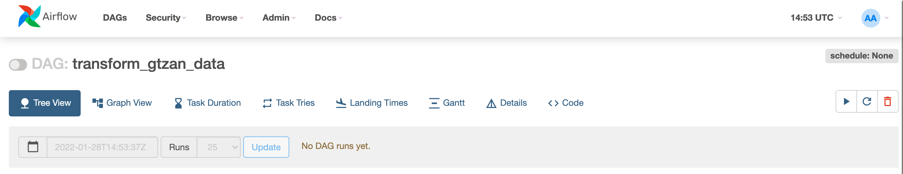

<h1 align="center">ETL Pipeline with Airflow and Python</h1>

<p align="center">
  <a href="#about">About</a> •
  <a href="#scenario">Scenario</a> •
  <a href="#prerequisites">Prerequisites</a> •
  <a href="#set-up">Set-up</a> •
  <a href="#installation">Installation</a> •
  <a href="#airflow-interface">Airflow Interface</a> •
  <a href="#pipeline-design">Pipeline Design</a> •
  <a href="#shut-down-and-restart-airflow">Shut Down and Restart Airflow</a> •
  <a href="#further-discussion">Further Discussion</a> •
  <a href="#credits">Credits</a>
</p>

---

## About

Utopia Music's Assignment to create a data pipeline for feature extraction and scaling with Python and Airflow.

The project is built in Python and it has 2 main parts:
  1. The Airflow DAG file, [**dags/utopia.py**](/dags/utopia.py), which orchestrates the data pipeline tasks.
  2. The PySpark data transformation/processing script, located in [**dags/utils**](/dags/utils/)


## Prerequisites
- [Docker](https://docs.docker.com/get-docker/)
- [Docker Compose](https://docs.docker.com/compose/)

## Set-up

- Make sure Docker Desktop is running.

- Download / pull the repo to your desired location.

- Download the GTZAN data set from [here](http://opihi.cs.uvic.ca/sound/genres.tar.gz) and extract into the input folder.


## Installation

Start the installation with:

    chmod 775 ./startup.sh && ./startup.sh (input_folder_here) (output_folder_here)

This command updates the [startup.sh]() script with execute permission and execute the script. [startup.sh]() asks for two parameters, absolute path of the input folder and absolute path of the output folder. The output folder should be empty, and the input folder should be organized like this:

```
/input_folder 
    /genre1
        file1.wav
    /genre2
        file2.wav
```

[startup.sh]() creates two named volumes, called input_folder and output_folder, and bind mount the indicated local directories to these volumes. Afterwards, it will pull and create Docker images and containers for Airflow, according to the instructions in the [docker-compose.yml](/docker-compose.yml) file. After everything has been installed, you can check the status of your containers (if they are healthy) with:

    docker ps

**Note**: it might take up to 30 seconds for the containers to have the **healthy** flag after starting.

<p align="center"></p>

## Airflow Interface

You can now access the Airflow web interface by going to http://localhost:8080/. If you have not changed them in the docker-compose.yml file, the default user is **airflow** and password is **airflow**:

<p align="center"></p>

After signing in, the Airflow home page is the DAGs list page. Here you will see all your DAGs and the Airflow example DAGs, sorted alphabetically. 

Any DAG python script saved in the directory [**dags/**](/dags/), will show up on the DAGs page (e.g. `transform_gtzan_data` is the one built for this project).

<p align="center"></p>

Click on the name of the dag to open the DAG details page:

<p align="center"></p>

## Pipeline Design

<p align="center"></p>

The two main tasks of this DAG are:
- extract features, which extract two features, Mel Spectrogram and MFCCs from each of the audio files, and store them as npy files into a temporary folder,
- and scale features, whichs go through each of the npy files in the temporary folder, and scale it in two ways, using standard scaler and min-max scaler from sklearn library, and store them as npy files into the final library.

The reasoning behind this design is to put an intermediary storage layer between the source and the destination folder. This helps us separate the testing and rerunning of the feature extraction and scaling.

On the other hand, there are tasks at the beginning and the end to clean up temporary folder and output folder content. 

#### Task `clean_up_temp_and_output`

Remove all contents within the temporary folder and the output folder. This is done to make sure the storing of numpy array goes through successfully.

#### Task `extract_features`

This task gets two parameters, which is an input folder and an output folder. It iterates through each sub-directories inside the input folder, and for each ".wav" audio file, it generates two numpy array which contains Mel Spectrogram feature and Mel-Frequency Cepstral Coefficients (MFCCs) feaature of that audio file. Afterwards, it saves these two numpy arrays as .npy files into the output folder, following the same organization of the input folder. The output folder is organized like this:

```
/temporary_folder 
    /genre1
        file1_melspectrogram.npy
        file1_mfcc.npy
    /genre2
        file2_melspectrogram.npy
        file2_mfcc.npy
```

#### Task `scale_features`

This task gets two parameters, which is an input folder and an output folder. It iterates through each sub-directories inside the input folder, and for each .npy audio file, it generates two numpy array which contains Mel Spectrogram feature and Mel-Frequency Cepstral Coefficients (MFCCs) feaature of that audio file.Afterwards, it saves these two numpy arrays as .npy files into the output folder, following the same organization of the input folder. The output folder is organized like this:

```
/output_folder 
    /genre1
        file1_melspectrogram_minmaxnormalizer.npy
        file1_melspectrogram_standardcaler.npy
        file1_mfcc_minmaxnormalizer.npy
        file1_mfcc_standardcaler.npy
    /genre2
        file2_melspectrogram_minmaxnormalizer.npy
        file2_melspectrogram_standardcaler.npy
        file2_mfcc_minmaxnormalizer.npy
        file2_mfcc_standardcaler.npy
```

#### Task `clean_up_temp_folder`

Clean up task to remove all the content in the temp folder.

## Shut Down and Restart Airflow

If you want to make changes to any of the configuration files [docker-compose.yml](https://github.com/renatootescu/ETL-pipeline/blob/main/docker-compose.yml), [Dockerfile](https://github.com/renatootescu/ETL-pipeline/blob/main/Dockerfile), [requirements.txt](https://github.com/renatootescu/ETL-pipeline/blob/main/requirements.txt) you will have to shut down the Airflow instance with:

    chmod 775 ./cleanup.sh && ./cleanup.sh
    
This command will shut down, delete any containers created/used by Airflow, and delete the Docker's bind mount volumes. **Note**: The local directories binded to these volumes are not deleted by this action. 

## Further Discussion

During the implementation of this pipeline, Airflow was used to be a processing framework, using Python operators. However, a better option for scalability is to offload the processing duty to a framework like Apache Spark, and use Airflow only to orchestrate the jobs.

## Credits
This repo is cloned from https://github.com/renatootescu/ETL-pipeline. Huge credits to Renato, this has given me a great headstart on how to set up Airflow with Docker.

## TODO

- describe how to save features in a database or data lake. describe what type of database, or data lake, you would use to store these features, how you would store the data and what design and architecture considerations you have to make this database / data lake scalable

- The extractor and normalization parameters as well as input and output paths should be configurable (e.g., window size, hop length, num frequency bands, num mfccs, ...).
The yaml config file should provide details regarding two aspects of the pipeline (see Entry Point section below):
    - Which feature extractor / normalizer to use
    - Values to use for the parameters of each component of the pipeline (e.g., save folder for data saver, dataset folder for data loading, number of bands (Mels) for (Mel-)Spectrogram extractor)